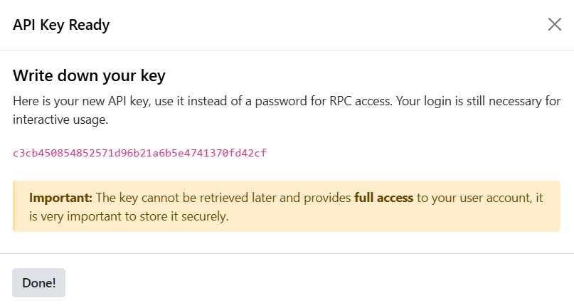
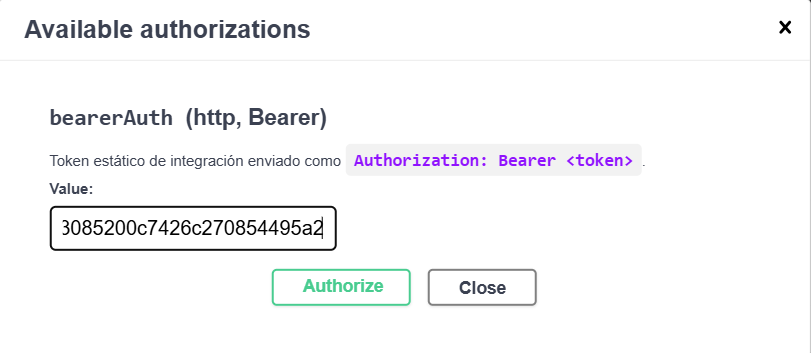
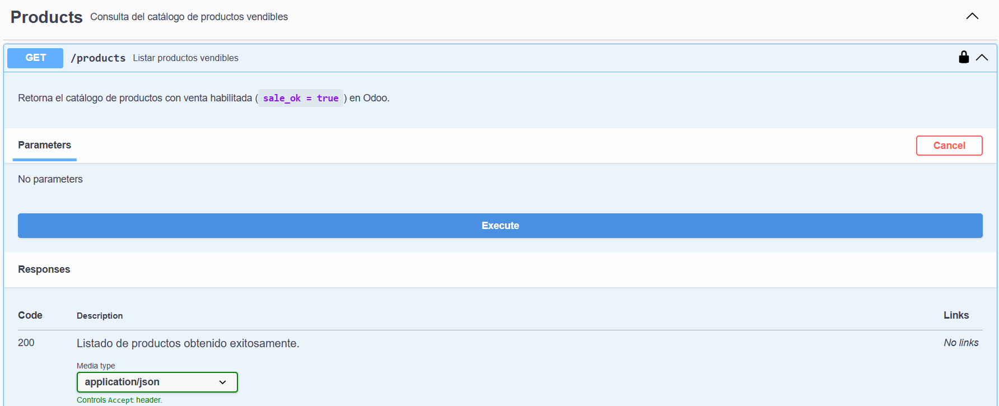

# Sale Order API Odoo

API de integración para procesar órdenes de venta externas en Odoo 19.

## 📋 Descripción

Este proyecto implementa un módulo Odoo (`sale_extended`) que integra órdenes externas con el sistema de Odoo. Incluye un modelo `IntegrationOrder` para gestionar el procesamiento, validación y sincronización de órdenes desde sistemas externos.

## 🚀 Tecnologías

- **Odoo**: 19.0
- **PostgreSQL**: 15
- **Docker & Docker Compose**: Para orquestación
- **Python**: Backend de Odoo

## 📁 Estructura del Proyecto

```
odoo-19/
├── docker/
|   ├── config/
|   |   └── odoo.conf   # Configuración de servicio Odoo
|   |
│   ├── compose.yaml      # Configuración de servicios Docker
│   └── .env              # Variables de entorno
|
├── docs/                   
|   ├── diagrams/        # Diagrama Logico y E/R
|   |   ├── Diagram E_R - Sale API Odoo.png
|   |   └── Diagram Logic - Sale API Odoo.png
|   |
|   ├── sql_queries.md  # Consultas SQL Modelo Sale API
|   └── swagger.yaml    # Doc OpenAPI
|   
├── extended/
│   └── sale_extended/
|       ├── controllers/
|       |   ├── __init__.py
|       |   ├── order_api.py    # API para validar y crear Integración
|       |   └── product_api   # API para obtener productos vendibles
|       |
|       ├── data/
|       |   ├── integration_cron.xml # Acción Programada new partner/sale
|       |   └── ir.sequence.xml # Secuencia Model Integración
|       |
│       ├── models/
|       |   ├── __init__.py
│       │   └── integration_order.py # Modelo integración
|       |
|       ├── security/
|       |   └── ir.model.access.csv  #  Permisos Model Integración
|       |
|       ├── views/
|       |   └── integration_sale_order_views.xml  # Action, Menu, View
│       ├── __init__.py
│       └── __manifest__.py
|
└── README.md
```

## 🔧 Instalación y Configuración

### Requisitos Previos

- Docker y Docker Compose instalados
- Puerto 8069 disponible (Odoo)
- PostgreSQL accesible en el puerto 5432

### 1 . Setup del Entorno

La primera configuración requiere instalar el modulo ``sale_extended`` una vez de ha ejecutado el entorno para contar con las dependencias necesarias y visualizar el modelo.

```bash
cd docker
docker compose up -d
docker compose exec web odoo -i sale_extended --stop-after-init
```

Si realiza cambios a nivel de vista(.xml), seguridad(.csv) ó traducción(.po) puede ejecutar el siguiente comando para actualizar los cambios

```bash
docker compose exec web odoo -u sale_extended --stop-after-init
```

### 2 . Autenticación y Credencial API 

el servicio de odoo esta disponible en: ``http://localhost:8069``, donde inicialmente podra ingresar como administrador con las credenciales:

- __email__: admin
- __password__: admin

para obtener el API_KEY que requiere el header de autenticación en las peticiones debe seguir los siguientes pasos:

1. Ingresar al menu ``/settings/users``, seleccionando el usuario admin. 
2. Seleccionar la pestaña ``Security`` y agregar un API KEY con el boton ``Add API Key``, inmediatamente se despliega un ventana emergente solicitando tu contraseña (admin).

    Antes de crear la llave se debe definir un nombre (Sale API) junto a una duración maxima a 3 meses para entornos productivos.
3. Al confirmar se crea una clave aleatoria segura de 160 bits. El valor de la clave se muestra solo una vez durante su creación y no se puede recuperar posteriormente

    

    __NOTA__: Debes guardar la clave en un lugar seguro, el repo contiene un archivo ``.env `` para almacenar credenciales y configuraciones de los servicios sin embargo cabe aclarar que solo es para uso local.

## 🧪 Pruebas y ejecución de la API

### Actualizar productos 

Si comienzas con una nueva base de datos y no tienes información de productos, el modelo requiere por lo menos la creación de un producto para validar y crear el pedido, en cuyo caso debes realizar los siguientes pasos:

1. Ingresar al menu ``Inventory/Products/Products`` y  seleccionar el botón ``New``.
2. Agregar un nombre(``name``) al producto y un codigo de referencia(``default_code``).

    __Nota__: Puedes crear un producto sin referencia, sin embargo este campo es el que permite analizar la solicitud de productos con el sistema externo.

### ✍️ Probar endpoints

La aplicación cuenta con un servicio ``swagger`` dedicado a la documentación de la API alojado en ``http://localhost:8090/``.Donde no solo se define la estructura y formato que se debe enviar en cada solicitud sino tambien se pueden realizar pruebas de cada endpoint.

La API cuenta con los siguientes endpoints:

* __Crear Pedido en Odoo(POST)__: ``http://localhost:8069/api/v1/orders``.
* __Consultar estado del Pedido(GET)__: ``http://localhost:8069/api/v1/orders/<external_order_id>``.
* __Consultar produuctos para la venta(GET)__: ``http://localhost:8069/api/v1/products``.

Para consultar cada endpoint debe agregar el API_key en el botón ``Authorize``



Posterior a ello puede modificar los ejemplos y realizar sus propias solicitudes con el botón ``Try it out`` o ``execcute``




**Versión**: 1.0  
**Última actualización**: 2026-07-14
